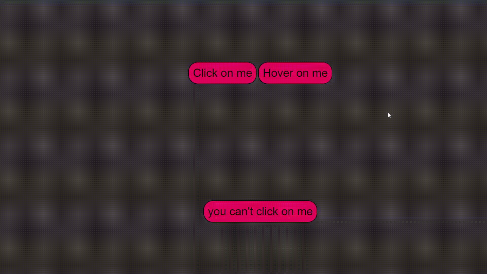

# buttons

On page 3 the buttons are "Click on me", "Hover on me" and "You can't click on me".
1. The button "Click on me" changes its color when pressed twice and then returns to its original position.
2. The "Hover on me" button changes its color when you hover over it with the cursor, after retracting the cursor, it returns to its original position.
3. The most interesting button "You can't click on me" changes its color when you hover over it with the cursor and immediately kills and so on until you click on it, after which a message pops up confirming that you are a cheater.

Preview:

